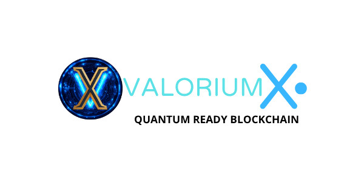

# Valorium X ($VQXAI)
**The bio-inspired blockchain with progressive autonomy**  
**The dawn of a new era of digital trust**

-blue?style=flat-square)

🇫🇷 **Lire ce document en français** → [readme_fr.md](readme_fr.md)

---

> **"The focus is not on the architect, but on the architecture."**  
> — Sylver Blade

## What is Valorium X?
Valorium X is a bio-inspired Layer-1 protocol designed for resilience, safety-by-construction, and long-term adaptability.  
We are not building another chain. **We are seeding a new digital organism.**

This repository hosts the public-facing core materials and reference implementation work around **VIC (Valorium Incentivized Consensus)** and the protocol’s research/simulation track.

✅ **No affiliation notice:** Valorium X is **not associated** with “Valorium AI” or “VALORIUM.AI”.

---

## Scientific Transparency & Responsible Disclosure
Valorium X follows a **verification-first** approach:

- **Public transparency:** high-level architecture, principles, and validated outcomes.
- **Controlled technical access:** sensitive specifications/components are shared through structured review (auditors, researchers, institutional partners).
- **Secure change process:** proposals → peer review → independent validation → security audit → deployment.

This preserves scientific credibility **without exposing exploitable mechanisms**.

---

## Core Principles (High-Level)
✨ We keep the public layer **clear**, and the security layer **sovereign**.

- 🧬 **Double Helix Ledger** — DNA-inspired structure model  
- 🔗 **Cryptographic Interlocking Proof (CIP)** — interlocking proof layer (tamper-resistance target)
- 🧠 **AI Advisory Coil** — guidance & monitoring (progressive roadmap)  
- 🪐 **Gravitational Consensus** — dynamic orchestration (research track)  
- ⚛️ **Quantum-ready** -(post-quantum roadmap)
- 🦾 **Progressive Autonomy** — self-repair and gradual automation over time

---

## A New Mathematical Framework (Public Summary)
To protect the **sovereignty** and long-term integrity of Valorium X, we also apply a new class of structural analysis methods (internal research framework) that:

- measures **structural coherence** across modules and rules,
- minimizes **attack surface growth** as complexity scales,
- enforces **consistency constraints** before deployment,
- supports **auditable outcomes** without exposing sensitive inner mechanics.

Full technical detail is shared via controlled review.

---

## Where to Start
📘 **New here?** Start with the newbie guide:  
➡️ [What Is Valorium X, Really? (Newbie Guide)](newbie.md)

🚀 Then:
- 🧭 Wiki (concepts & architecture): https://github.com/SylverbladeX/ValoriumX/wiki/
- ⚙️ Quickstart (dev entry): [QUICKSTART.md](QUICKSTART.md)

---

## Status (Phase 1 — Research & Simulation)
Phase 1 focuses on:
- ✔️ core architecture design
- ✔️ threat modeling
- ✔️ simulation & validation work
- ❗ DAO, testnet, and official Rust SDK: **coming later**

Official ticker page: **https://vqxai.com/**

> Note: if any value/“flux” is displayed publicly, it should be considered **simulation/placeholder** until an official launch announcement.

---

## Official Links & Contacts

### Websites
- Website: https://valoriumx.org — Main portal
- Website: https://valoriumx.com — Alternate access
- Ticker Website: https://vqxai.com — Branding & Ticker

### Documentation
- Docs & Wiki: https://github.com/SylverbladeX/ValoriumX/wiki
- Whitepapers: /whitepapers
- Newbie Guide: /newbie.md

### Security & Responsible Disclosure
- Security contact: security@valoriumx.org
- Public bug bounty portal: coming soon
- Note: security-critical implementation details may be disclosed via controlled review (vetted auditors/partners) and signed releases.

### Development
- This repository: https://github.com/SylverbladeX/ValoriumX
- How to contribute: /CONTRIBUTING.md

### Community & Social
- Discord: https://discord.gg/valoriumx
- Telegram: https://t.me/valoriumx
- Twitter/X: https://x.com/ValoriumX
- Facebook: https://www.facebook.com/valoriumx1
- Instagram: https://www.instagram.com/valoriumx/
- YouTube: https://www.youtube.com/@valoriumx
- TikTok: https://www.tiktok.com/@valoriumxofficial

> ✅ For official communication, always refer to the links above.

---

## License
MIT — see [LICENSE.txt](LICENSE.txt)
